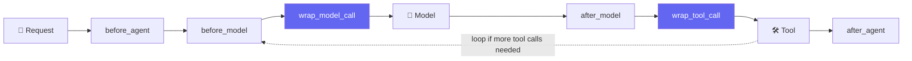
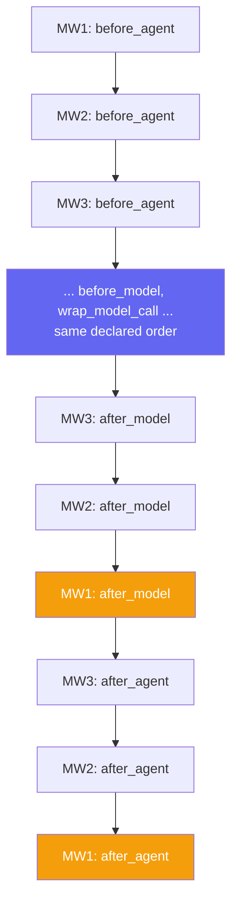

# 🐚 Class 14 — Shell Tools & Writing Custom Middleware From Scratch
### Agentic AI 3.0 Specialization | Live Class 2026

**🎙️ Mentor:** Mayank Aggarwal · **📅 Date:** 16 August 2026 · **⏱️ Duration:** ~4.5 hours

> 📂 **Code for this class:** *(not yet shared in this repo — notes compiled from the live session and the accompanying `custom_middleware.py`)*
> 🔗 Live Colab used in class: [Notebook](https://colab.research.google.com/drive/1CpnGhWhGG4r8NCIoh0WEmcPEVb6KJ2TH?usp=sharing)

---

Finishes the built-in middleware catalog with **Shell Tool Middleware**, then spends the bulk of the session on **custom middleware** — the hooks system for writing your own. By the end, the course was estimated at roughly 20–25% complete.

## 🐚 Shell Tool Middleware — Building Your Own "Claude Code"

How do Claude Code, Cursor, or GitHub Copilot actually create and edit real files on your machine? The trick: **access to a terminal.** Anyone who can run shell commands can create, edit, or delete files — that's the entire mechanism behind "AI that edits your code."

```python
from langchain.agents.middleware import ShellToolMiddleware, HostExecutionPolicy

cinebot_shell_agent = create_agent(
    model=model,
    tools=[],
    middleware=[
        ShellToolMiddleware(workspace_root="/content/cinebot_workspace", execution_policy=HostExecutionPolicy()),
    ],
)
```

**Where does the agent actually run?** Not on some LangChain server — on the machine running the notebook. Google Colab is a real, full Linux machine rooted at `/content`. The model provider only supplies the brain (deciding *which* command to run); execution happens wherever the agent's code is running, using whatever shell access it's been given.

| Execution policy | Behavior |
|---|---|
| `HostExecutionPolicy()` | Full, direct access to the host machine — trusted environments only |
| Docker-based policy | Isolated container per agent run — nothing touches the host directly |
| Codex sandbox policy | Reuses an existing Codex CLI sandbox for extra isolation |

Live demos ran a real write → execute → clean-up cycle: creating folders, writing a `nba_research.txt` (landing directly in the workspace, unlike ChatGPT's own sandbox which can never reach your real machine), writing and running a `Hello_world.py`, and building/running a small calculator app. This is, in essence, how Claude Code, Cursor, and GitHub Copilot work under the hood — a capable brain paired with real shell access.

## 🧩 Why Custom Middleware Is Necessary

Every built-in middleware is inherently generic — LangChain can't anticipate every business's specific rules (e.g. *no customer books more than two movies in one session*, or *flag it if the bot ever mentions a competing cinema by name*). This is the same relationship Pydantic has to plain Python: Python doesn't natively validate fields, so a dedicated layer was built on top.

## 🪝 Hooks: Six Points to Intercept Execution

> *"Hooks are extension points in custom middleware that let you intercept, inspect, or modify agent execution at specific stages of the lifecycle."*



The six hooks: **before_agent, before_model, wrap_model_call, after_model, wrap_tool_call, after_agent.** `before_agent`/`after_agent` each run exactly **once per invocation** (start and end). Everything between can run **multiple times**, once per pass through the agentic loop.

**Why no `before_tool`/`after_tool`?** A LangChain-specific design choice — Google's ADK does expose separate tool callbacks. LangChain folds that into `wrap_tool_call` instead, achieving the same result — frameworks, like languages, make different trade-offs.

**`before_model` vs. `wrap_model_call`:** `before_model` gives read-only access to **state and runtime** — good for logging, not for rewriting the request. `wrap_model_call` gives you the **actual request object**, letting you genuinely modify what's about to be sent (swap the model, strip tools, alter messages).

## ✍️ Decorator-Based Custom Middleware

```python
from langchain.agents.middleware import before_model, before_agent, after_agent

@before_model
def log_before_model(state, runtime) -> dict | None:
    """Log every call about to be made to the model."""
    print(f"[LOG] About to call model with {len(state['messages'])} messages so far")
    return None  # None means "observed, nothing to change"

@before_agent
def connecting_to_DB(state, runtime) -> dict | None:
    print("I have connected to DB")
    return None

@after_agent
def disconnecting_to_DB(state, runtime) -> dict | None:
    print("I have disconnected to DB")
    return None

logged_agent = create_agent(model=model, tools=[], middleware=[connecting_to_DB, log_before_model, disconnecting_to_DB])
# Output order: "connected to DB" -> "[LOG] About to call model..." -> "disconnected to DB"
```

`before_agent` is the natural place to open a resource (DB connection) needed for the whole run; `after_agent` the natural place to close it.

**Why does "before model" need its own hook, separate from "before agent"?** If a user's first message already contains PII, should it be redacted at `before_agent` (before it ever enters the system) or `before_model` (right before the brain sees it)? A tool like `get_booking` might genuinely need the *real* booking ID — stripping too early breaks that. But the model itself doesn't need the raw value — masking specifically at `before_model` protects the brain while leaving the real value available to tools that legitimately need it.

## 🎁 `wrap_model_call`: VIP Gating and Dynamic Model Selection

```python
@wrap_model_call
def gate_vip_tools(request, handler):
    """Only expose book_vip_lounge to VIP members."""
    is_vip = request.state.get("is_vip_member", False)
    if not is_vip:
        request = request.override(tools=[t for t in request.tools if t.name != "book_vip_lounge"])
    return handler(request)

advanced_model = init_chat_model("anthropic:claude-sonnet-4-6")
basic_model = init_chat_model("anthropic:claude-haiku-4-5-20251001")

@wrap_model_call
def dynamic_model_selection(request, handler):
    """Use a cheap model for short conversations, a capable one once it gets complex."""
    chosen_model = advanced_model if len(request.state["messages"]) > 10 else basic_model
    return handler(request.override(model=chosen_model))

cost_aware_agent = create_agent(model=basic_model, tools=cinebot_tools, middleware=[dynamic_model_selection])
```

A short exchange doesn't need the most expensive model; past a length threshold, it's auto-upgraded — functionally the same idea behind ChatGPT's and Claude's own model-routing. `wrap_model_call` is the right hook here because it hands over the *exact request object*, letting you override the model before the call goes out.

## 🏗️ Two Ways to Define Middleware: Decorator vs. Class

| | Decorator-based | Class-based |
|---|---|---|
| Best for | A single hook, quick prototyping | Multiple hooks, more complex/reusable config |
| Sync/async | One implementation only | Can define both sync *and* async versions |
| Reuse | Re-decorate each time | Define once, instantiate and reuse |

```python
class CallCounterMiddleware(AgentMiddleware):
    def __init__(self, warn_after: int = 3):
        super().__init__()
        self._num_calls = 0
        self.warn_after = warn_after

    def before_model(self, state, runtime):
        self._num_calls += 1
        if self._num_calls > self.warn_after:
            print("That's a lot of calls — keep your credit card ready.")
        return None
```

A class can hold its own internal state (`self._num_calls`) across invocations — something a bare decorated function can't do as cleanly. Class-based is the production preference once a middleware needs more than one hook, internal state, or reuse across projects.

**Extending a pre-built middleware** works via plain Python inheritance — subclassing `PIIMiddleware` and overriding `before_model`/`after_model` replaces that hook's behavior, while adding an entirely new hook type (like `wrap_model_call`) the parent never used is also fair game. No requirement to use decorator syntax inside a class — a method with the matching hook name is picked up automatically.

## 🔢 Middleware Execution Order — The Cooking Analogy



**Rule:** every "before" and "wrap" hook runs in the exact declared order. Every **"after" hook runs in reverse** — the last middleware's `after_model`/`after_agent` fires first. Logical once framed right: whichever connection opens first should close last (a stack, LIFO, not a queue). One exception: `wrap_tool_call` does **not** reverse — same declared order as everything else.

A concrete case: a single PII middleware genuinely needs *two* hook points — masking input at `before_model` so the brain never sees it, **and** checking the model's own output at `after_model`, in case the model itself fabricates something sensitive.

## ✅ Best Practices for Custom Middleware

- Keep each middleware focused on **one thing well**
- Handle errors gracefully inside the middleware itself — its own bug shouldn't crash the whole agent
- Choose the right hook deliberately — node-style for observation, wrap-style when the request needs to change
- Document any custom state a middleware relies on or introduces
- Test middleware independently where possible
- Default to a **built-in middleware whenever one already covers the need**

## 💬 Live Q&A Highlights

| Question | Answer |
|---|---|
| What can `wrap_model_call` change, beyond the examples shown? | Anything on the outgoing request: model, messages, system message, tool choice, tools list, response format, state, runtime, settings. |
| Is LangChain's execution graph a DAG? | No — the agentic loop can cycle (model → tool → model again). LangGraph exposes and lets you control that graph directly. |
| Real difference between `before_model` and `wrap_model_call`? | Restaurant analogy: `before_model` is being seated before the meal — you can observe and set some things up. `wrap_model_call` is wrapping the whole experience — you specify the exact order, down to "no onions." |
| Should one project mix LangChain, LangGraph, and other frameworks? | Generally no — pick one framework; connect genuinely separate systems via A2A or a plain API instead. |
| Can a browser-based app get the same terminal access as Claude Code? | No — browsers are deliberately sandboxed. Needs an installed application or a proper access layer like MCP, never raw browser automation. |

## ✅ Action Items

- [ ] 🐚 Recreate the `ShellToolMiddleware` demo — create a file, run a script, clean up — and read the message history
- [ ] 🪝 Write a `before_agent`/`after_agent` pair simulating a resource connect/disconnect, confirm print order
- [ ] 🎯 Build `dynamic_model_selection` with your own two models and threshold
- [ ] 🏗️ Convert a decorator-based middleware into a class-based `AgentMiddleware` with internal state
- [ ] 🧬 Subclass `PIIMiddleware` and add one new hook it didn't originally have
- [ ] 🔢 With three middlewares on one agent, verify "before runs in order, after runs in reverse"
- [ ] 📖 Come back ready for **MCP** — taught first in plain Python before its LangChain integration

---
*Part of the [Live-Class-2026](../README.md) class summary index · ⬆️ [Weekend 08 overview](<../Weekend 08 - 15-16 Aug/README.md>). ⬅️ [Class 13](<13 - 09 Aug - Guardrails, Todo Lists & Tool Resilience.md>) · ➡️ [Class 15](<15 - 22 Aug - Runtime & Human-in-the-Loop.md>)*
