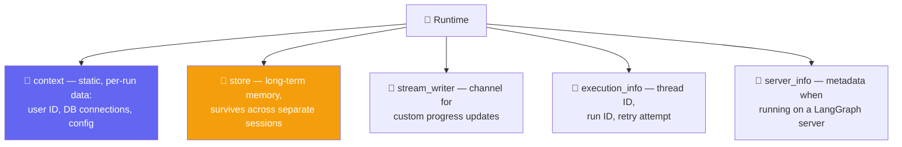
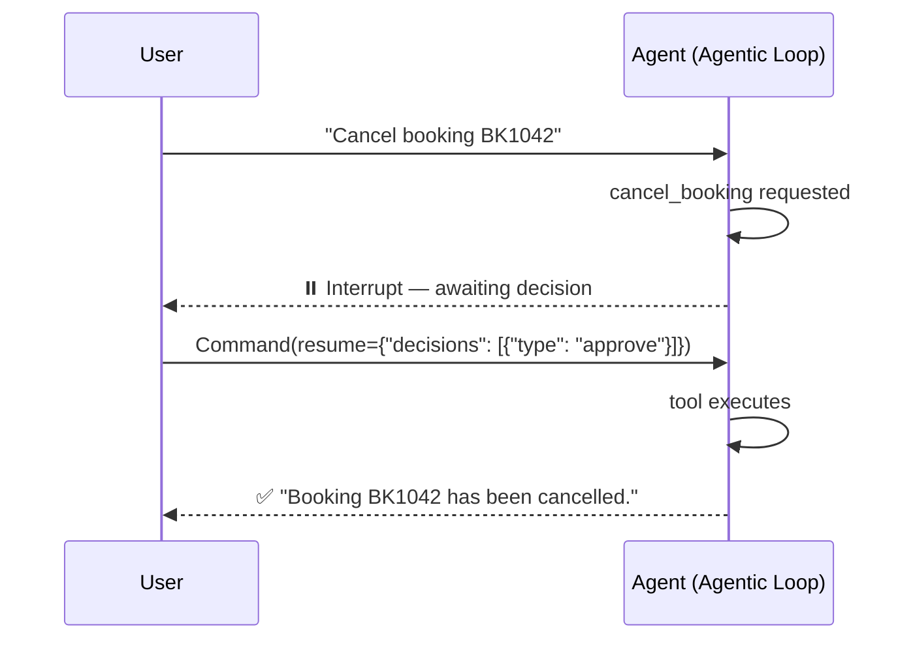

# 🧠 Class 15 — Runtime Deep Dive & Human-in-the-Loop in Depth
### Agentic AI 3.0 Specialization | Live Class 2026

**🎙️ Mentor:** Mayank Aggarwal · **📅 Date:** 22 August 2026 · **⏱️ Duration:** ~4.5 hours

> 📂 **Code for this class:** *(not yet shared in this repo — notes compiled from the live session and the accompanying `Runtime_and_HITL.ipynb`)*
> 🔗 Live Colab used in class: [Notebook](https://colab.research.google.com/drive/1dFuLlELzyS2NDIBgeVOowrqGJGFPERSL?usp=sharing)

---

Two focused topics — **Runtime** and **Human-in-the-Loop** — before a genuine deep-dive detour into **MCP** (minimum 3–4 classes, framework-independent first). The philosophy: understanding MCP in depth before rushing to "use" it the LangChain way makes every future framework's version of it trivial — the same approach applied to LangChain itself from Day 1.

## 🩹 The Problem Runtime Solves

CineBot needs to know things **not part of the conversation**: which customer is talking, whether they're a VIP, which cinema location this session belongs to. A chat app like ChatGPT or Claude clearly knows a user's tier, name, preferences without those facts ever being typed in.

> **The hospital wristband analogy:** a patient's wristband lets every department — ER doctor, pharmacist, any nurse — read who they are and their history without re-explaining themselves each time. That information isn't part of any single conversation; it travels with the patient wherever they go.

That's runtime: information that isn't conversation history, but still needs to travel with the agent everywhere — into every tool call, every middleware hook.

## 🧩 The Five Components of Runtime



`create_agent` runs on **LangGraph's runtime** underneath — LangChain exposes what LangGraph already maintains. Every framework maintains some equivalent concept under a different name.

## 🎬 Defining Context: `context_schema`

```python
from dataclasses import dataclass
from langchain.agents import create_agent

@dataclass
class CineBotContext:
    user_name: str

agent_with_context = create_agent(model="openai:gpt-5-mini", tools=[], context_schema=CineBotContext)

result = agent_with_context.invoke(
    {"messages": [{"role": "user", "content": "What's my name?"}]},
    context=CineBotContext(user_name="Priya"),   # injected at invocation time
)
```

`context_schema` declares the *shape* of per-run information an agent expects. Passing `context=` at invocation injects it without it ever appearing in conversation — though simply passing context doesn't automatically make the agent *use* it (that link is made deliberately, e.g. via dynamic prompting below).

## 🛠️ Runtime Inside Tools: `ToolRuntime`

```python
from langchain.tools import tool, ToolRuntime
from langgraph.store.memory import InMemoryStore

@dataclass
class CustomerContext:
    user_id: str

loyalty_store = InMemoryStore()

@tool
def fetch_customer_preferences(runtime: ToolRuntime[CustomerContext]) -> str:
    "Fetch the customer's saved preferences from long-term memory"
    user_id = runtime.context.user_id
    if runtime.store and (memory := runtime.store.get(("users"), user_id)):
        return memory.value["preferences"]
    return "No preferences"

pref_agent = create_agent(model="openai:gpt-5-mini", tools=[fetch_customer_preferences],
                           context_schema=CustomerContext, store=loyalty_store)
```

The ID travels through `runtime.context.user_id`; the tool reads long-term preferences straight from the store — without the user ever stating it in conversation. This is exactly how Claude "remembers" a user's name or preferences across sessions. Tools don't get a raw reference to a shared runtime object floating around — they get a `tool_runtime` parameter, deliberately passed, bundling the five runtime components plus tool-specific extras (state, config, tool call ID).

## 🔀 Who Gets What: State vs. Runtime vs. Tool Runtime

The single most repeated idea of the session:

- **State** holds conversation history (`messages`) plus custom fields.
- **Runtime** holds the five components above.
- **Tools** get both, bundled as `tool_runtime`, plus tool-specific extras.
- **Node-style hooks** (`before_model`, `after_model`) receive `state` and `runtime` as two separate parameters.
- **Wrap-style hooks** (`wrap_model_call`) receive one `request` object containing both.

None of this is optional — a deliberately broken hook (zero parameters) failed immediately with *"takes 0 positional arguments but 2 were given,"* proving state and runtime are always sent regardless of whether a function catches them. Parameter *names* don't matter, only *position and count*.

## 💬 Dynamic Prompting & an Authorization Gate

```python
from langchain.agents.middleware import dynamic_prompt

@dynamic_prompt
def personalize_the_prompt(request):
    user_name = request.runtime.context.user_name
    return f"You are CineBot. Always address the user as {user_name}."

@before_model
def auth_gate(state, runtime) -> dict | None:
    "Block unauthenticated users"
    if runtime.server_info is not None:
        raise ValueError("Unauthenticated user")
    print(f"[AUTH] Passed for user {runtime.context.user_name}, thread {runtime.execution_info.thread_id}")
```

`dynamic_prompt` is the concrete mechanism behind a chat assistant greeting a returning user by name without that name ever being typed in the current conversation. The auth-gate example pulls `execution_info.thread_id` and `server_info` together to build real gating logic before a model call proceeds.

## ✋ Human-in-the-Loop, In Depth

> Agents run in a loop — the **Agentic Loop**, already hand-built in raw Python. HITL is simply the moment a human is deliberately brought *into* that loop.

An unguarded `cancel_booking` tool cancels immediately — no questions asked, no authorization. HITL needs the checkpointing/memory mechanics from earlier classes (`InMemorySaver` + `thread_id`) since it must pause and resume later.

```python
from langchain.agents.middleware import HumanInTheLoopMiddleware
from langgraph.checkpoint.memory import InMemorySaver
from langgraph.types import Command

guarded_agent = create_agent(
    model="openai:gpt-5-mini",
    tools=[cancel_booking, send_booking_confirmation],
    middleware=[
        HumanInTheLoopMiddleware(
            interrupt_on={
                "cancel_booking": True,                # all four decisions allowed
                "send_booking_confirmation": False,    # safe, auto-approved, never pauses
            },
            description_prefix="CineBot action pending your approval",
        ),
    ],
    checkpointer=InMemorySaver(),   # REQUIRED
)

config = {"configurable": {"thread_id": "hitl-demo-111"}}
result = guarded_agent.invoke({"messages": [("user", "Cancel booking BK1042")]}, config=config, version="v2")
# result.interrupts -> action_request naming the tool, its args, allowed decisions

resumed = guarded_agent.invoke(Command(resume={"decisions": [{"type": "approve"}]}), config=config, version="v2")
```



**The four decision types:**

| Decision | What happens |
|---|---|
| `approve` | Executes the original tool call unchanged |
| `edit` | Modifies arguments before executing |
| `reject` | Skips execution entirely |
| `respond` | Answers with a message *without* calling the tool — the human supplies missing info, the tool result is skipped and the human's message is fed back as though it came from the tool |

## 🎯 Conditional Interrupts

Not every action needs a human — an interview-style scenario: only involve a human when a refund crosses a threshold.

```python
from langchain.agents.middleware import ToolCallRequest

def is_large_refund(request: ToolCallRequest) -> bool:
    return request.tool_call["args"].get("amount", 0) > 100

conditional_agent = create_agent(
    model="openai:gpt-5-mini",
    tools=[cancel_booking_priced],
    middleware=[HumanInTheLoopMiddleware(interrupt_on={
        "cancel_booking_priced": {"allowed_decisions": ["approve", "edit", "reject"], "when": is_large_refund},
    })],
    checkpointer=InMemorySaver(),
)
```

Confirmed live: a $25 refund sailed through with zero interrupt; a $500 refund on the exact same tool paused for approval — same tool, same middleware, the interrupt is entirely conditional on the call's actual data.

## 🗺️ What's Next

MCP begins next class — taught deliberately independent of LangChain first (full architecture, building a client and server from scratch, publishing to the cloud), before circling back to its LangChain integration. VS Code setup required — this portion isn't done in Colab.

## 💬 Live Q&A Highlights

| Question | Answer |
|---|---|
| Real difference between state and runtime context? | Mutability and persistence — state is mutable, persists across invocations in the same conversation; context is immutable per run, for static values like a user ID. |
| Is MCP basically the same as defining tools in LangChain? | Yes, in a simple sense — MCP is a collection of tools wrapped in a standardized protocol; the "agent calls a tool" mechanic doesn't change. |
| When should I use LangGraph instead of LangChain? | When LangChain's default control isn't enough — every `create_agent` already builds a LangGraph graph internally; LangGraph lets you reach into and modify that same graph directly. |
| How to reduce token usage in a long-running conversation? | Long-term memory (the `store`, via runtime) — retrieve only semantically relevant memories for the current message, rather than resending full history every time. |

## ✅ Action Items

- [ ] 🩹 Recreate `CineBotContext` and confirm `context=` at invocation is accessible without being part of the conversation
- [ ] 🛠️ Build `fetch_customer_preferences` with `ToolRuntime` + a real `InMemoryStore`, confirm persistence across calls
- [ ] 🪝 Define a hook with zero parameters and observe the "takes 0 positional arguments but 2 were given" error firsthand
- [ ] ✋ Recreate `unguarded_agent` vs. `guarded_agent` — confirm one cancels immediately, the other pauses for approval
- [ ] 🔄 Practice all four HITL decisions — `approve`, `edit`, `reject`, `respond`
- [ ] 🎯 Build `is_large_refund` and confirm a small amount sails through while a large one interrupts
- [ ] 🖥️ Set up VS Code ahead of next class — MCP will be taught there, not in Colab

---
*Part of the [Live-Class-2026](../README.md) class summary index · ⬆️ [Weekend 09 overview](<../Weekend 09 - 22-23 Aug/README.md>). ⬅️ [Class 14](<14 - 16 Aug - Shell Tools & Custom Middleware.md>) · ➡️ [Class 16](<16 - 23 Aug - MCP Introduction.md>)*
