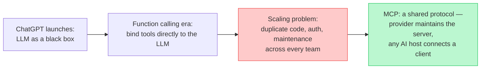
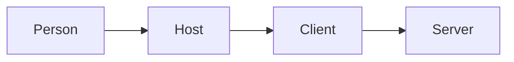
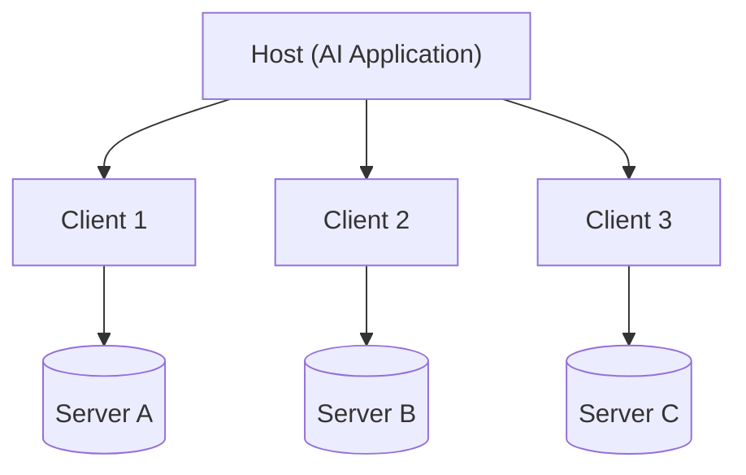
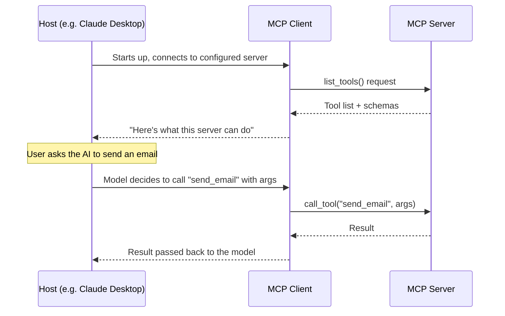
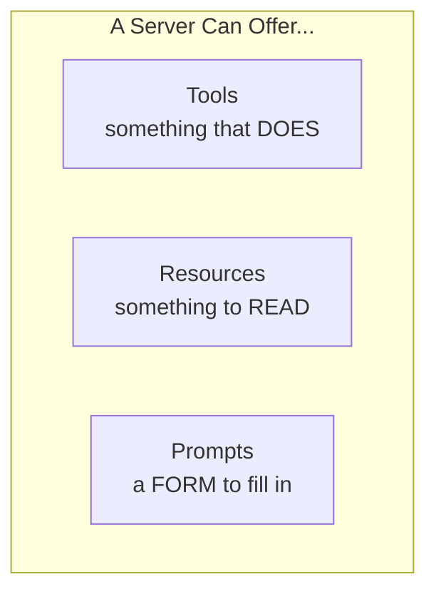

# 🔌 Class 16 — MCP 1: Why MCP Had to Exist
### Agentic AI 3.0 Specialization | Live Class 2026

**🎙️ Mentor:** Mayank Aggarwal · **📅 Date:** 23 August 2026 · **⏱️ Duration:** ~5 hours

> 📂 **Code for this class:** [`23rd Aug - MCP/Complete MCP/`](<../Weekend 09 - 22-23 Aug/23rd Aug - MCP/Complete MCP/>) — `p2_MCP_Architecture.ipynb`, `mcp-warmup/server.py`, `Commands.txt`, `Why MCP Had to Exist.txt`

---

Day 1 of the MCP module — expected to run **3–4 classes** in full depth: protocol internals, building servers/clients from scratch, dockerizing, and publishing a server as a package.

## 🧠 From Black Box to Hands: Why MCP Had to Exist

**ChatGPT launches (Nov 2022)** — ~1M users in a week. Underneath, it was just an LLM, a next-token predictor: **"just a brain"** — it could write a great leave-application email, but had no hands to actually *send* it.

**Step 1 — Function calling (mid-2023):** bind tools/functions to an LLM — it could tell you *which* function to call and with what arguments, though it never executes anything itself.

**Step 2 — The scaling problem:** a company running three AI assistants, each touching ~20 tools, means dozens of tools each with their own auth, data format, error handling, and breakage risk whenever an underlying API changes. Multiply that across every company doing the same integration work independently — tool-calling solved the problem at individual scale but recreated it as a maintenance problem at company scale.

**Step 3 — Anthropic's answer:** a *protocol*, not another wrapper — a shared language, the way HTTP is a shared language for the web. An application exposes "here are my tools, resources, and prompts" once, and any AI host can speak to it the same way. That protocol is **MCP: Model Context Protocol.**



> *"MCP is not about giving our LLM more intelligence. It is about giving it an ability to see more."*

That's also why "context" is in the name — Model, Context, Protocol.

## 📖 What MCP Actually Is

An **open-source standard for connecting AI applications to external systems** — data sources, local files, databases, tools, search engines, calculators, workflows, specialized prompts. Deliberately skipping the "USB-C port" analogy for oversimplifying: an MCP server is fundamentally a **collection of tools** (~99% of real usage), wrapped around APIs that already existed, plus two other **MCP primitives** — resources and prompts.

## ⚖️ Before vs. After MCP

| | Before MCP | After MCP |
|---|---|---|
| Defining an integration | Easy for a single API — any LLM can wrap one quickly | Easy to *connect* — point your host at the server |
| Maintenance | Every team writes and maintains its own wrapper — violates DRY at scale | Sits with whoever runs the server (usually the provider) |
| Change management | Provider changes their API → every integrator updates their own code | Server absorbs the change; clients untouched |
| Security | Every tool needs its own auth, owned by you | Still needs auth, but centralized at the server |

At 500 teams all wrapping the same "send email" API independently, you haven't saved effort — you've just relocated it. MCP's value isn't a new capability so much as who's responsible for keeping the integration working.

## 🏗️ Architecture: Host, Client, and Server

MCP follows a client-server pattern plus one added layer — the **host**, the actual application a person uses (Claude Desktop, VS Code, Cursor, any LangChain/LangGraph app). The host doesn't talk to a server directly — it starts an **MCP client** internally, and the client does the talking.

> **Mobile phone is your host, network is your server** — with the SIM card as the client in between, since a phone can't reach the network without one.



**The client is one-per-server, not one shared line.** A host connected to five servers runs five separate clients, each a dedicated 1:1 connection — never one shared connection to all five.



**Why dedicated connections, not one shared line?** Decoupling, safety, scalability, parallelism. Killing one server's connection (a live `Ctrl+C` test) leaves the other four untouched — a crash stays contained to that one connection.

**Transport layer:** client and server speak **JSON-RPC 2.0**, not plain REST. Two transport types — **STDIO** for local servers, **Streamable HTTP** for remote/hosted servers (replacing the older HTTP+SSE, deprecated in the March 2025 spec).



A real cost flagged live: connecting even two MCP servers to Claude already added a large chunk of tokens to a single "hi" — the **entire tool list from every connected server is sent up front**, on the first message. Middleware/interceptors are the mechanism for trimming the tool list to only what's relevant per request.

## 🎛️ What a Server Can Offer: Three Primitives



- **Tools** — executable actions with a real effect (`greet`, `add` below). The one primitive that lets an AI application actually *do* something.
- **Resources** — read-only reference data, no side effects. Without a shared resource, every client hard-codes its own copy of the same reference data, and copies quietly drift apart over time. One resource, read fresh by everyone, means one copy of the truth.
- **Prompts** — reusable templates shaping *how* a request gets phrased. A server handing over a template requiring four fields every time (issue, what was tried, sentiment, next step) beats an AI logging "customer unhappy, refund maybe" with no structure — the model didn't change, only the presence of a form did.

*(Full working code for resources and prompts is a planned follow-up — this session covered the shape and reasoning for all three, with real running code only for tools.)*

## 💻 Live Demo: A Local MCP Server, End to End

```bash
curl -LsSf https://astral.sh/uv/install.sh | sh    # macOS/Linux
uv init mcp-warmup && cd mcp-warmup
uv add fastmcp
```

```python
from fastmcp import FastMCP

mcp = FastMCP("Warm-Up Server")

@mcp.tool
def greet(name: str) -> str:
    """Greet someone by name."""
    return f"Hello, {name}! Welcome to MCP."

@mcp.tool
def add(a: int, b: int) -> int:
    """Add two numbers together."""
    return a + b

if __name__ == "__main__":
    mcp.run()
```

No special MCP boilerplate beyond `@mcp.tool` — FastMCP picks up each function's docstring as the tool description automatically.

```bash
uv run fastmcp dev server.py   # opens MCP Inspector at http://127.0.0.1:6274
```

**MCP Inspector** connects to any MCP server and lets you try its tools directly, no full AI application required — calling `greet` and `add` from the Tools tab is Inspector (host + client) and `server.py` (server) completing a task together over the real protocol.

**Wiring the same server into VS Code:** register `uv run python server.py` as the launch command (`Add Server` → STDIO), working directory set to the folder containing `server.py`. **Claude Desktop:** Manage Connectors → Add custom connector — the same server works across hosts with zero changes, the actual point of the demo. A locally-running server can be shared with a small team by port-forwarding/tunneling (not the most secure option); full team-wide hosting and publishing to PyPI is next-class territory.

## 🗺️ What's Next

Full working code for resources and prompts, authentication patterns, and live-building + publishing an MCP server to PyPI. After MCP wraps: back to LangChain, then multi-agent systems, then at least two cloud-based projects.

## 💬 Live Q&A Highlights

| Question | Answer |
|---|---|
| How is MCP different from calling a REST API directly? | Same functional end result, but with a raw API *you* maintain the wrapper, auth, and error handling everywhere it's used. With MCP, the server owner maintains it once. |
| Won't connecting many MCP servers blow up context? | Yes — the full tool list from every connected server is sent on the first message. Middleware/interceptors can filter to only relevant tools. |
| Can an MCP server "extend" another one? | Not in a code-inheritance sense — but a server *can* contain a client internally that forwards requests to another server. Not a common pattern. |
| How is MCP different from RAG? | Unrelated mechanisms — RAG retrieves and injects relevant text into a prompt; MCP is a protocol for letting a model call tools/actions on external systems. |
| Is MCP an Anthropic product you pay for? | No — a free, open specification, now governed by a multi-company foundation. |

## ✅ Action Items

- [ ] Work through `p2_MCP_Architecture.ipynb` end-to-end: build `server.py`, run `uv run fastmcp dev server.py`, call `greet`/`add` from Inspector
- [ ] Try the `Ctrl+C` safety test — kill the running server while Inspector is connected, confirm only that one connection closes
- [ ] Register the same server as a STDIO server in VS Code and/or a custom connector in Claude Desktop
- [ ] If prepping for interviews touching MCP auth, read up on JWT tokens and OAuth flows

---
*Part of the [Live-Class-2026](../README.md) class summary index · ⬆️ [Weekend 09 overview](<../Weekend 09 - 22-23 Aug/README.md>). ⬅️ [Class 15](<15 - 22 Aug - Runtime & Human-in-the-Loop.md>)*
